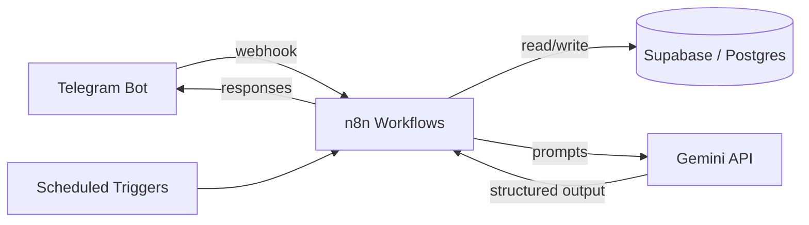
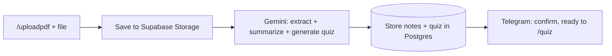

# LifeOS

A personal operating system for college — a Telegram-driven automation layer that manages tasks, study, knowledge, projects, finances, and career prep through one connected pipeline instead of six disconnected apps.

**[Live interactive overview →](https://de9856.github.io/LifeOS/)**

Built on **n8n**, **Supabase**, and the **Gemini API**, running 24/7 at zero ongoing cost.

---

## Why LifeOS

Most student projects are single-purpose — a to-do app, an expense tracker, a weather app. LifeOS is a task manager, study assistant, knowledge base, career coach, project logger, and analytics engine, all connected through one shared data model and one chat interface.

- ✅ Actually used daily, not built-and-abandoned
- ✅ AI used for reasoning (prioritization, gap analysis, generation), not just wrapped API calls
- ✅ Proper relational schema shared across every module
- ✅ Real workflow orchestration (n8n), not a single monolithic script
- ✅ Zero infrastructure cost, genuinely always-on

---

## Modules

| # | Module | What it does |
|---|--------|---------------|
| 01 | **Core OS** | Task/goal/calendar management, morning briefings, AI-driven prioritization |
| 02 | **StudyOS** | PDF ingestion → auto-summary, quiz generation, GPA tracking |
| 03 | **Knowledge Vault** | Save any article/video/repo → auto-tagged, searchable second brain |
| 04 | **ProjectOS** | Daily check-ins → automatic changelogs and weekly reports |
| 05 | **CareerOS** | Application tracking + resume-vs-job-description gap analysis |
| 06 | **Finance Tracker** | Natural-language expense logging, budget alerts |
| 07 | **AnalyticsOS** | Cross-module weekly digest with a computed productivity score |

---

## Tech stack

| Layer | Tool | Notes |
|---|---|---|
| Hosting | DigitalOcean → Oracle Cloud Always Free | Student credit funds year one, migrates to free-forever tier |
| Automation | n8n (self-hosted) | Docker container, handles every scheduled/triggered workflow |
| Database | Supabase (Postgres) | Row-level security, storage, auth — one schema for all modules |
| AI | Gemini API | Prioritization, summarization, quiz generation, resume analysis |
| Interface | Telegram Bot API | Primary interface — commands, natural language, file uploads |
| Dashboard *(planned)* | React + Tailwind | Visual layer added once the backend is stable |

---

## Architecture



### Example: PDF → Quiz pipeline



---

## Database schema (excerpt)

```
users            (id, telegram_id, name, timezone)
tasks            (id, user_id, title, priority, status, due_date)
documents        (id, user_id, title, subject, file_url, summary)
quiz_questions   (id, document_id, question, answer, difficulty)
knowledge_items  (id, user_id, type, title, url, summary, tags[])
daily_logs       (id, user_id, date, task, issue, learning)
applications     (id, user_id, company, role, stage, deadline)
expenses         (id, user_id, amount, category, note, date)
weekly_scores    (id, user_id, week, productivity_score, recommendation)
```
18 tables total across 7 modules — full schema in [`docs/overview.html`](docs/overview.html).

---

## Build order

- [x] **Phase 1 — Foundation:** droplet, Docker, n8n, Supabase, Telegram bot, core tables
- [x] **Phase 2 — Core loop:** task commands, Morning Brief, goal tracking, AI prioritization
- [ ] **Phase 3 — StudyOS:** PDF ingestion, summarization, quiz generation
- [ ] **Phase 4 — Knowledge Vault:** multi-type capture, auto-tagging, search
- [ ] **Phase 5 — ProjectOS:** daily check-ins, auto changelogs
- [ ] **Phase 6 — CareerOS:** application tracker, resume gap analysis
- [ ] **Phase 7 — AnalyticsOS:** cross-module aggregation, weekly scoring
- [ ] **Phase 8 — Dashboard:** React frontend, Supabase Auth, polish

---

## Cost

| Service | Cost |
|---|---|
| DigitalOcean | $0 (GitHub Student Pack credit, 12 months) |
| Oracle Cloud Always Free | $0 forever (post-year-1 migration) |
| Supabase | $0 (free tier) |
| n8n | $0 (self-hosted, open source) |
| Telegram Bot API | $0 |
| Gemini API | $0 (free tier) |
| **Total** | **$0** |

---

## Setup

```bash
# clone
git clone https://github.com/yourusername/lifeos.git
cd lifeos

# configure environment
cp .env.example .env
# fill in: TELEGRAM_BOT_TOKEN, SUPABASE_URL, SUPABASE_KEY, GEMINI_API_KEY

# start services
docker compose up -d
```

Full setup walkthrough in [`docs/overview.html`](docs/overview.html).

---

## Roadmap beyond v1

- Year 2 — deeper automation across all modules
- Year 3 — self-trained ML model for task/habit prediction (moving from AI consumer to AI builder)
- Year 4 — full personal operating system with mobile companion app

---

## Development Progress

### ✅ Milestone 1 — Infrastructure & Telegram Gateway

Completed:

- Dockerized local development environment
- Self-hosted n8n instance
- Telegram Bot integration
- Cloudflare Tunnel for webhook exposure
- Supabase project configuration
- Environment variable management
- First end-to-end Telegram workflow

Current workflow:

```text
Telegram
    │
    ▼
Cloudflare Tunnel
    │
    ▼
n8n
    │
    ▼
Telegram Response
```

The project now has a fully working automation pipeline and is ready for database integration.

---

**Next milestone**

- User registration
- Supabase database schema
- Task storage
- Command router

## License

MIT — see [LICENSE](LICENSE).
